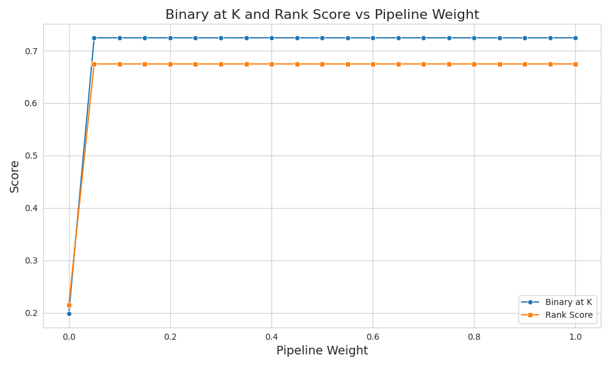
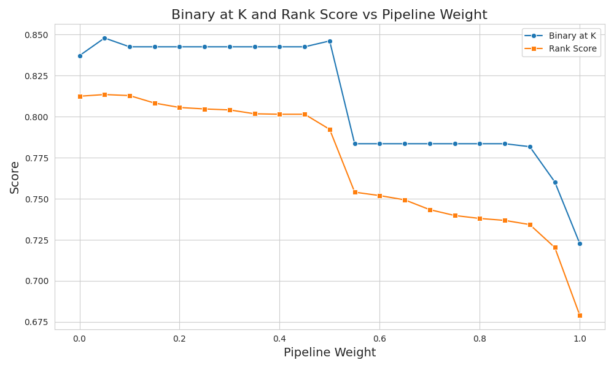
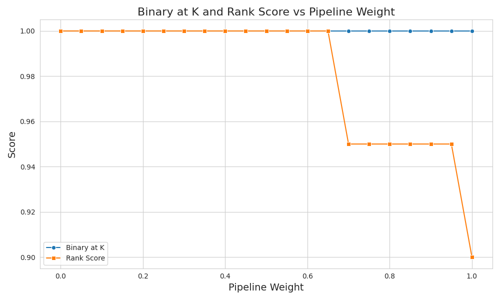

<!--  -->
# Table of Contents

- [Introduction](#introduction)
  - [Project Requirements - MoSCoW](#project-requirements---moscow)
- [System Architecture](#system-architecture)
  - [Functional Overview](#functional-overview)
  - [Technological Decisions](#technological-decisions)
- [Data Preparation](#data-preparation)
  - [Data Scraping](#data-scraping)
  - [Data Extraction](#data-extraction)
  - [Document Model](#document-model)
- [Retrieval](#retrieval)
  - [OpenSearch](#opensearch)
  - [Retrieval Testset Generation](#retrieval-testset-generation)
  - [Re-Evaluating new Hybrid Search](#re-evaluating-new-hybrid-search)
  - [Natural Language Based Metadata Filtering](#natural-language-based-metadata-filtering)
- [Answer Generation](#answer-generation)
  - [Choice of Generation Backend](#choice-of-generation-backend)
  - [Choice of Generation Model](#choice-of-generation-model)
  - [Routing - Question-Type Dependent Answer-Generation](#routing---question-type-dependent-answer-generation)
  - [Evaluation](#evaluation)
- [User Interface](#user-interface)
  - [Confidence](#confidence)
- [Related Work](#related-work)
- [Conclusion / Resulting QA-System](#conclusion--resulting-qa-system)
- [Contributions](#contributions)
  - [Dominik Ochs](#dominik-ochs)
  - [Theo Stempel-Hauburger](#theo-stempel-hauburger)
  - [Lukas Rapp](#lukas-rapp)
  - [Benedikt Vidic](#benedikt-vidic)


# Introduction

This is the project report for our graded *Natural Language Processing with Transformer* module of Heidelberg University. In this section, we have designed and listed the business requirements for a PubMed-supported question answering system.

## Project Requirements - MoSCoW

When we started our project, we thought of requirements and categorized them:

### Must-Have Requirements

1. Answering in natural language: The system must be capable of understanding and responding to queries in natural language, ensuring a user-friendly interaction.
2. Support for various Question Types:
   - Confirmation Questions: Yes/No type questions.
   - Factoid Questions: To provide concise, factual answers to "Wh"-Questions.
3. Abstractive Answer Generation: The ability to synthesize answers from multiple sources rather than extracting text. This allows for more nuanced and comprehensive responses.
4. Context-based Answering: Answers must be derived based on the context provided by a retrieval system which works on the user query.
5. Context Citation: The contexts used for answering the question should be provided to the user as sources.

### Should-Have Requirements

1. Natural Language Metadata Filtering: The system should allow users to filter answers based on metadata in natural language queries, such as:
   - Time-based filtering (e.g., "Cancer research after 2022").
   - Title-based filtering (e.g., "Title must contain 'Covid'").
1. User Interface (UI): A basic UI to interact with the system.

### Could-Have / Nice-to-Have Features

1. Confidence metric: Showing a confidence metric for retrieved contexts.
2. Graphical User Interface (GUI): Development of a website as a more accessible and interactive platform for users.
3. Additional Context info: Providing extra details such as links to the original papers or documents for further reading.
4. More Question types:
   - Casual Questions: For example explaining connections.
   - Hypothetical Questions: To explore speculative scenarios.

### Won't-Have Features

1. Dialogue model with chat history: The system will not support to remember the history of the chat.

# System Architecture {#architecture}

The *G2 PubMed RAG-System Architecture* has been designed from scratch to enable
custom solutions and for better learning effects. However, regarding
technologies, the architecture has been guided by the lecture
and tutorials. The following graphic shows the architecture and corresponding data flow:


## Functional Overview
Our RAG system relies on data fetched from the `PubMed` database. In a
first step, we scrape all relevant information from `PubMed` and then
store it locally. The data is then processed, so that unnecessary
information can be discarded. From there, we extract information to
construct `Abstracts` (the entire PubMed abstracts) and `Abstract Fragments` (the chunks we got by splitting the abstract). Those are then ingested
into our dockerized `OpenSearch` instance, from where we can access the
processed and sanitized data from now on. Technically, that step has to
be done only once.

When the user issues a query in the interface, we extract filtering
options - such as title and a publication date range - from the query.
Both are then passed to a `Retriever` interface, which we can swap out
(e.g. for retrieving abstract fragments or whole abstracts or for totally
different retrieval architecture). The retriever interacts with the
`OpenSearch API`, using wrapper-functionality that we encapsulated in our `OpenSearch Connector`,
to retrieve the requested documents from a given index (e.g. index for
abstracts or fragments).

The documents are then sent back to the interface, where they are
displayed alongside a self-constructed confidence rating, so that the
user can assess the significance of the answer and perform further
research if needed. Using the retrieved documents, a model then answers
the question. The interface then shows the relevant sources (retrieved
documents) and their confidence (or rather relevancy) ratings and the
answer generated by the LLM.

## Technological Decisions

We decided for `OpenSearch` because it
supports a variety of search mechanisms, namely BM25 (syntactic
search) and neural search (semantic search), which we want to rely on
to realize a powerful hybrid search. Furthermore, there already exists
a communication library in Python, which we used to combine all
components and to introduce custom functionality (e.g. confidence
ratings).

For document embedding we used the `S-PubMedBert-MS-MARCO` embedding
model, which we use for embedding abstract fragments before ingestion
into OpenSearch, and for embedding the user query. We have to use the
same embedding model for embedding abstract fragments and run-time
queries, because otherwise we cannot compare their respective vector
representations to search for documents.

For self-querying and answer generation we decided to employ the `mistral` LLM which is being made
accessible locally using `ollama`.
Furthermore, we used `streamlit` for a web-based interface that allows
the user to productively interact with our retrieval system and be shown
additional information, such as the sources.

In the following we will further explain the individual components and the associated decisions we took.

# Data Preparation

The first part is getting the correct PubMed abstracts in a usable format into our OpenSearch database. This consist of four main steps.

1. **Data Scraping**: We have to download all abstracts that are somehow
connected to the topic *Intelligence*. The data is fetched as XML and
is then stored locally for further processing.

2. **Data Extraction**: We have to extract the relevant information
from data dump we scraped beforehand. That means that we discard
information that we deem not interesting (e.g. citation graph) for our
architecture. Note that we keep all information that seems relevant
at first. We discard the obviously irrelevant data, which means that
maybe some of the remaining data will not be used later.

3. **Document Model**: From the sanitized data, we construct
a dataset containing only abstracts and one containing only abstract
fragments. That is necessary because both document formats have
different metadata. Since we want to search for abstract fragments in
OpenSearch, we have to assign them their embedding vectors, which is
not needed for the abstracts. Both datasets are later ingested into
two separate indices with differing structure. Note that this stage
includes tokenization, removing special characters, converting text to
lowercase and stemming/lemmatizing words.

4. **Ingestion**: The preprocessed abstract and fragment datasets then get
inserted into indices in OpenSearch to be searchable. We won't go
into detail in a later section as this did not involve any interesting decisions.
Ingestion is mostly configuration of the stored data format.

To be a bit more precise, we want to elaborate on what information
specifically we discarded. First, it is not possible to search by
journal as it is not listed on which pages an article appeared.
Second, we dropped the author affiliation as it does not help in
answering the question. Third, authors consist of only names and might
represent a natural person or describe entities or groups. Lastly,
we also discarded reference chains (who cited whom) as that information
could theoretically be used for answering (when searching for "related"
papers) but that is much too complex for what is achieves.

## Data Scraping
We obtained the necessary data from PubMed using our `development/scrape/pubmed_scraper.py` script. The PubMed database has a payload
limit, which is why we cannot fetch all relevant abstracts at once.

Instead, we resorted to requesting the relevant abstract ID's and
downloaded them in batches of size $s_{id} = 10,000$, starting from
the publication year $2013$ - $2023$. Only after that did we
retrieve the actual abstracts in batches of size $s_{ab} = 1,000$.
In total, we retrieved $n = 62,967$ documents. The fetched abstracts
(with metadata) are stored into a single file using `pickle`.

## Data Extraction
We use our `development/scrape/pubmed_extractor.py` script to
extract the most relevant data. It extracts information and bundles
it in the following format, which is found throughout the whole
project as it is the base for ingestion and subsequent retrieval:

```
{
 "pmid": int,
 "doi": str,
 "title": str,
 "author_list": list[str],
 "abstract": str,
 "publication_date": date|str,
 "keyword_list": list[str]
}
```

Note that at this stage no splitting has taken place, we only
parsed the information from the raw XML data. Furthermore, the
data model exhibited by the data PubMed returns is partially
inconsistent, intransparent or hard to grasp. For example, we had
our fair share of trouble with extracting the publication date,
which is of utmost importance for filtered retrieval. There exist
a handful of cryptic fields containing dates in a document
response. We picked one and later found out that not each document
has that field with that data, which lead to problems with self-querying.

For example, a possible date field is accessed via `document["MedlineCitation"]["Article"]["Journal"]["JournalIssue"]["PubDate"]`.
We verified that each document has that field and that it has a value.
However, the content greatly varies:

```
{'Year': '2013'}
{'Year': '2013', 'Month': 'May'}
{'Year': '2013', 'Month': 'Jun', 'Day': '24'}
{'Year': '2013', 'Season': 'Jan-Mar'}
```

Sometimes, only the year is contained, sometimes a season and sometimes
a fully-fledged date. However, that is hard to parse correctly,
especially when there could be more special cases. Answering the
question about what "the" publication date is, is hard because it could
mean the date of the latest revision, the date of publishing it to a
journal or the date of publishing it to PubMed. Hence, we decided to
access the latest element in the `document["PubmedData"]["History"]`
field, which always yields a reasonable date in the `YYYY-MM-DD` format.

From the $62960$ obtained documents, a total of $4388$ documents
has been discarded because they had no abstract - which is mandatory for
searching. That leaves us with $58572$ valid documents. Furthermore,
a total of $50$ documents were author-less.

## Document Model

Each abstract is split into fragments using the `SentenceTransformersTokenTextSplitter` of the `langchain` library.
It is used to accurately split texts for the specific embedding model used (which is Huggingface's `pritamdeka/S-PubMedBert-MS-MARCO` (350 token model) in our case).

Additionally, we define an overlap of 32 tokens of each fragment, to capture semantic context more coherently and to avoid breaking context too abruptly,
in case an answer is at the splitting point of two fragments. This ensures the answer can still be answered using either fragment instead of being lost.
Example:

- Full text: The Declaration of Independence was signed by George Washington earlier that year.
- Split without overlap: ["The Declaration of Independence was signed by George", "Washington earlier that year."]
- Split with overlap: ["The Declaration of Independence was signed by George Washington earlier", "signed by George Washington earlier that year."]
- Question: By whom was the Declaration of Independence signed?

In this example, the split without overlap could not answer the question fully because of missing context / the answer being split across fragments. With overlap we aim to minimize the probability of this happening. The number 32 was more or less arbitrarily chosen. It is large enough to ensure that there are no meaningless sentence fragments but still not too large, as this leads to indistinct fragments,
thus blurring the line between fragments during semantic text search.

Moreover, we noticed that in a first run, where we left the `tokens_per_chunk` parameter untouched, we received 76146 fragments from 55924 documents (this was an older scrape, therefore the number of documents is a little bit smaller than the current version).
This means that, on average, each abstract yielded 1.36x fragments. By inspecting the resulting fragments, we found that oftentimes most of the abstract
test was contained in the first fragment, where the second fragment only included the tail of the document.
In these cases, the second fragment doesn't include a lot of meaning, so that the chunking process effectively equates a truncation process.
To remedy this, we set a `tokens_per_chunk` number lower than the limit of 350 tokens. 

To not run into any input token limit issues with our answering system, as well as to make the second fragment more meaningful, we settle for a `tokens_per_chunk` of **256** tokens. 
With this token limit, the number of fragments rose to 101571 fragments and the factor to 1,82.

Furthermore, we thought about splitting the abstract at paragraphs first, before then running it through the token splitter. However, this yields fragments where for example the
result paragraph of the abstract is in its own fragment, but reading these paragraphs on their own is really confusing and doesn't give much insight, since you just read some random results, without knowing what they are results of. However, often the answer to a specific question can be found in the result paragraph. But without knowing the context of the results, they are worthless. By not splitting at paragraph boundaries, the result paragraph is combined with the previous paragraph, thus giving the results some context.

Lastly, we decided against including any of the metadata in the fragment text to be embedded for semantic search. Instead, we tackle this by evaluating a hybrid search.
We hope to enrich our search with this hybrid search in a meaningful, more interpretable, easier and more structured way, as opposed to including the information in the text data.

### Document Splitting Bug

While developing and experimenting with our retriever we sometimes encountered unusually short document fragments, even shorter than our overlap window for the document splitting. This kind of fragment should not exist. This is an issue because these fragments do not provide useful information for generating answers but potentially achieve exceptionally high scores by our retrieving system because they are so short.
After looking further into it we discovered that this weren't just a few exceptions. We found 8109 fragments that only included text that is already fully present in their preceding fragment (The code to find and count these documents can be found in `development/ingest/analyse_fragment_split.py`).

We could track it down to a bug in the langchain text splitter that was not accounting for the overlap when checking whether to add a new fragment. In December 2023 this issue got addressed and the fix released in the new langchain version ([Github commit that fixed this](https://github.com/langchain-ai/langchain/commit/ea331f31364266f7a6414dc76265553a52279b0a)). Therefore the solution for us to clean up the fragments simply consisted of updating the langchain version and redoing the document splitting and OpenSearch ingestion.

<!--  -->
# Retrieval

## Querying OpenSearch - Hybrid Search

To query OpenSearch, we use the opensearch-py Python library, which allows us to make API calls to OpenSearch directly from Python. Because the library itself is fairly low-level we decided to abstract away the details of it. To archive this, we created an [``opensearch_connector.py``](../../development/retrieve/opensearch_connector.py) that serves as a wrapper around the `opensearch-py` library, implementing all the functionality that is relevant for us.

To find relevant documents, we explored two main methods - `BM25` and `Semantic Search`.

BM25 can be utilized to identify documents containing specific keywords such as "Covid-19" or "Influenza". These keywords, when present in the search query, increase the likelihood of the document being about that particular illness rather than a semantically similar illness or topic. We believe this precision is particularly crucial in the medical field. Additionally we can use BM25 to match on multiple other metadata fields of the documents, such as the title, authors or keywords and not only on the text of the abstract-fragments. 
This type of query translates to an [``Multi-match query``](https://opensearch.org/docs/latest/query-dsl/full-text/multi-match/) in OpenSearch, with the corresponding match-field as implemented in the [``create_multi_match_BM25_query``](../../development/retrieve/opensearch_connector.py#L137) function.

In order to find a document that matches a given query, while also taking into account the semantic meaning of the query, we decided to incorporate a semantic search. The idea is that this will take synonyms into account and also be able to 'read between the lines' and better understand the intent of the query.
We achieve this by querying the [abstract_fragment_embeddings field](#document-model) of the abstract-fragment documents with the embedded search-query. The embedding of the query is generated by the same model that was used to embed the abstract-fragments. This way we can compare the semantic similarity of the query and the documents.
The corresponding OpenSearch query-type for this is the [``k-NN query``](https://opensearch.org/docs/latest/search-plugins/knn/index/) which we implemented in the [``create_knn_query``](../../development/retrieve/opensearch_connector.py#L144) function.

Since both approaches have their own strengths and weaknesses, we combined them to form a hybrid search. This way, we can benefit from the precision of BM25 and the semantic understanding in the semantic search. Luckily for us, combining different queries in OpenSearch is relatively straightforward. It involves, first combining both sub-queries into a single query like in the  [``create_hybrid_query``](../../development/retrieve/opensearch_connector.py#L155) function. Secondly creating a [``search pipeline``](https://opensearch.org/docs/latest/search-plugins/search-pipelines/index/) in OpenSearch for hybrid search that combines the results of the different queries, like in the [``create_hybrid_search_pipeline``](../../development/evaluate/retrieval/ingest_search_pipelines.py#L12) function. Here we can specify how results of the different queries are weighed and combined into a single result. And lastly executing the query against an opensearch index with the specified pipeline, like in the [``execute_hybrid_query``](../../development/retrieve/opensearch_connector.py#L62) function. The `pipeline_weight` parameter here specifies how the semantic search is weighed. Correspondingly, the BM25 search is weighed with `1 - pipeline_weight`. 
This allows us to always use the same hybrid search-quey, even for isolated BM25 or semantic search, by just setting the `pipeline_weight` to 0 or 1 respectively.


## Retrieval Testset Generation

For our retriever we want to generate a set of questions for which we have a ground truth. The ground truth in the context of the retriever does not mean the answer to the question but rather the id of an abstract fragment that can be used to properly answer this question. Therefore we prompted a language model to generate questions, each based on an abstract fragment. We decided to use a strong language model, ChatGPT 3.5, to generate the questions to ensure better quality.
We wrote a script that takes a random document and prompts the open-ai API to generate a question for that. With the first versions of our prompt we encountered the issue that a lot of questions are formulated in a way that they are only useful when you already have the document, e.g. "What were the findings of the study?". After improving the prompt over multiple iterations we managed to reduce the frequency of questions like these, but sometimes they still appeared. Because we did not achieve any further progress with prompt engineering we implemented some kind of "validation" afterwards, that filters the generated questions based on a few key phrases like "in the study" which were present in most of the invalid questions. However, this potentially still leaves a few questions that might not make sense without the context.

## Evaluating Pipeline-Weights with OpenSearch Hybrid Search

We want to check how good different retrieval Pipelines (in OpenSearch) are at retrieving relevant documents for a given query-document pair dataset.
Therefore, we use OpenSearch’s Hybrid Search with different weights.
The main hyperparamter for these tests is Neural Search Weight $w$. The weight of BM25 will then be $1 - w$. A weight $w = 1$ means only Neural Search is employed and a weight of $w = 0$ means only BM25 is employed. Any other values are a weighted blend between the two.  

In these pipelines, the BM25 parts match on multiple fields of the document, namely the 'abstract-fragment', 'title' and 'keywords' fields. The neural search pipeline only matches on the embedding of the 'abstract-fragment' field, which we named 'abstract-fragment-embedding' in the documents.
  
As a test set we use the previously described auto-generated test set constructed with OpenAi GPT-3.5Turbo. Explicitly, to test this, we first take the Question (query) of the test set, then retrieve the most relevant $i$ document abstract-fragments for the given pipelines. In the following, we evaluate on the entire test set how good the retrieval was, based on how many of the retrieved documents were the actual ground truth documents from which the question was generated.  
For the evaluation we use the following metrics:

- Binary Accuracy at k: This score returns 1 if the ground-truth document was in the top-k of retrieved documents, or 0 else.
- Rank Score: This computes the spot of the ground-truth document in the list of retrieved documents. Returns 1 if document is at the top spot, 0 if the ground-truth document is not within the retrieved documents and $1/s$ else, where $s$ is the spot of ground-truth in the list of retrieved documents.

We tested in 0.05 increments of the weight. The result is shown in the following figure: 



We can see that only $w=0$ performs relatively poorly compared to $w>0$, and all other results are on the same level. This is highly unexpected and odd. We would expect to see a more gradual shift as the weight increases. Therefore, we did further investigation and found out that from w=0.05 to w=1 all the same documents are retrieved, whilst for w=0 totally different documents are retrieved by OpenSearch. Unfortunately, we can not debug the OpenSearch code and therefore have to assume that this is a bug. Especially, since sporadically calculating the min-max normalized score combinations of BM25 and Semantic Search ourselves, lead to other scores than those returned by OpenSearch’s Hybrid Search. 

## Hybrid Search via MinMax Normalization vs Reciprocal Rank Fusion

Therefore we decided to implement a different approach. The issue we had was only with the OpenSearch pipeline, not the individual queries. This means we can still use the same queries as before, now we just execute them separately and combine the results afterward. For the combination of the result lists, we chose ([``Reciprocal Rank Fusion``](https://plg.uwaterloo.ca/~gvcormac/cormacksigir09-rrf.pdf)) (RRF) <<TODO: Properly cite>>, because the returned scores of the two separate queries are not necessarily comparable which means we need some kind of fusion that is based on ranks and not the specific scores. Moreover, it is easy to assign weights to our two queries with RRF, so that we can choose to put more emphasis on either the BM25 or semantic search.
In our code, we used a mocked version of the ([``Langchain's Ensemble Retriever``](https://python.langchain.com/docs/modules/data_connection/retrievers/ensemble)) that already has the RRF implemented (see `development/retrieve/retrieval_wrapper.py: _retrieve_abstract_fragments_reciprocal_rank_fusion()
`).

## Re-Evaluating new Hybrid Search

We then evaluated our custom hybrid query as an alternative to the OpenSearch hybrid query. We repeated the same evaluation from before (see Evaluating Pipeline-Weights with OpenSearch Hybrid Search) and tried out different weightings between the two queries.

The results show that BM25 performs significantly better on our retrieval testset than the semantic search. At first, this was a bit surprising to us because we did not expect to see such a clear trend favoring one search type over the other. But when looking in more detail at our testset, the results make sense. The drawback of generating questions each based on a fragment is that the resulting question is very similar to its respective document. Most of the words in the question were taken directly from the fragment and the questions rarely contain any synonyms. This of course favors a syntactical search like BM25.

### Automatic Testset Generation with Ragas

To improve our testset we looked into ([``ragas``](https://github.com/explodinggradients/ragas)), a framework that promises to help evaluation of RAG pipelines. Ragas not only supports evaluation but also implements its on spin of synthetic test data generation, information about it can be found in their ([``docs``](https://docs.ragas.io/en/stable/concepts/testset_generation.html)).

We first implemented the ragas TestsetGenerator with openai based embeddings and models, leveraging the `gpt-3.5-turbo-16k` model and `ada-002` embeddings. However, during generation of a limited testset with only 10 entries we encountered significant costs in our openai-dashboard. For these 10 entries ragas made 1,105 API requests to the gpt-3.5 model with an astonishing amount of 488,443 overall tokens used. This resulted in an overall cost of $1.53, which is way too much for such a small dataset. Extrapolating that to a meaningful dataset size of e.g. 500 entries would cost $76.5, too much for our group project.  
To reduce this cost we tried to utilize locally running models inside ragas’ TestsetGenerator-Class ([``(our code)``](../../development/evaluate/retrieval/local_ragas_testset_generator.py)) as  presented ([``here``](https://docs.ragas.io/en/stable/howtos/customisations/bring-your-own-llm-or-embs.html)) in their docs. This sadly did not work out, leaving us stuck with our previous testset.

### Evaluation on Ragas Testset
Keep in mind that the following is only based on our very small ragas testset with 10 entries, therefore quantitative analysis of this dataset doesn't provide statistically relevant results.  
However looking at the questions ourselves provides us with a good idea of how ragas’ generated questions look ([``(ragas-testset)``](../../development/evaluate/retrieval/testsets/ragas-testset_test.json)). 

Example question from the ragas testset:

"What is the relationship between **publicly accessible benchmarks** and **progress in artificial intelligence** in the **medical practice** field?"  

Here the phrases in bold are also present in the abstract fragment which was used as context to generate the question. This is a lot of exact overlap. Looking at the quantitative results, this also shows. In this limited dataset, questions generated with ragas don’t seem to improve much upon our previous dataset.



It does however reach higher scores overall which could be contributed to even higher overlap between questions and contexts. This could also be a source of less ‘unanswerable’ bad questions in the dataset.
This could also be due to our dataset potentially still including more questions for which the corresponding abstract fragment is not inferrable see ([``retrieval``](#retrieval-testset-generation)).

## Natural Language Based Metadata Filtering

In order to enable user queries where additional filters are specified, like the publication date of an article, we sought to implement the Self-Query Retriever of Langchain which allows this behavior ([``LangChain Documentation: Self-Query OpenSearch Retriever``](https://python.langchain.com/docs/integrations/retrievers/self_query/opensearch_self_query)). To this end, we implement a custom Vectorstore. It retrieves filters from a user query which can be used in our OpenSearch queries. This is done by querying a GenAI model to extract filter parameters in a vectorstore-agnostic language and then translate this domain specific language to an OpenSearch filter query. We then extend our existing queries by these filter queries. 

### Model Performance Comparison

As GenAI model for query filter extraction we tested:
- Llama2: It could not follow the instruction to extract filter parameters at all. Even when playing with the temperature and prompt. Absolutely unsuitable.
- Gemma: It was able to extract parameters and was especially proficient in getting mathematical comparisons like greater than or lesser than right. However, it was too strictly adhering to the prompt. For example, when we queried it to extract *the year of the publication* it could only handle queries like "Cancer research after 2015", but not "Cancer research after January 1st 2015". However, when changing the prompt to *the date of the publication*, it could no longer handle "Cancer research after 2015".
- Mistral: Mistral got this right more easily. It was able to make the abstraction and return the queried parameters, no matter if only a year of specific date was provided. However, Mistral struggled with correctly extracting comparison operators. This is in line with the claims made by Google, which promised Gemma to outperform other small-scale models in terms of mathematical ability (Found in this report: [Gemma Team, Google Deep Mind: Gemma: Open Models Based on Gemini
Research and Technology](https://storage.googleapis.com/deepmind-media/gemma/gemma-report.pdf)). However, by fiddling with the temperature we got Mistral to work and extract greater than/less than correctly.

This is why we eventually chose Mistral to do the self-querying.

### Results

However, Mistral, it not always succeeds to extract filters correctly. Sometimes, it fails to properly format as json, so the output formatter (trying to create a json) crashes and filtering is skipped. Furthermore, it fails to recognize filters in some queries. However, time-based filtering does work quite well now. For example query `cancer research after 2015` correctly extracts `>2015` as filter and applies it to retrieve context.

# Answer Generation

## Choice of Generation Backend

Unfortunately, with our setup, we can not use Google Colab. This is because Google Colab can only access publicly hosted databases, which our OpenSearch instance is not because we have no server for it. This is why we need to ensure hardware acceleration with local devices.

We chose Ollama as backend for Llama2 because hardware acceleration is essential in order to receive answers in real time.
However, getting the hardware acceleration set-up properly is very time-consuming and cumbersome with other solutions.
To improve the user experience and workflow for our team we evaluated the following frameworks:

- Downloading the model directly and quantizing it ourselves: The quantization process takes quite a lot of time and space.
Also, on Windows, the libraries are not updated to perform 4bit quantization without custom C++ compilation. It is much better to use an already quantized model.
- CTransformers: It allows for downloading already quantized models. However, it is extremely hard to get hardware acceleration working on MacOS.
- LlamaCpp: It also allows for downloading already quantized models, but it requires a lot of manual configuration for hardware acceleration.
- Ollama: It provides by far the easiest setup (as easy as installing any app), allows for already quantized models and, additionally, it has Langchain support.

## Choice of Generation Model

We did several tests with different light-weight generation models to determine which model is fit best for our application. We decided to use a light-weight model in order to execute it on most common personal devices. These models are usually in the range of 3-5 GB disk storage and fit into most devices with 8-16 GB memory. They offer good performance for their small size and should be sufficient to do simple question answering.

### Llama 2

For our test with Meta's Llama 2 model, we used a 4 bit quantized version of the 7 billion parameter model. It requires 3.8 GB of disk space. The next largest model with 13 billion parameters and 7.2 GB in disk space already exceeds the limits for our use case and the ability to use it with local machines.

Llama 2 showed bad performance especially when it came to adhering to the prompt and its instructions. It frequently ignored prompt instructions and added seemingly random information to the answer. Questions with missing context were often met with hallucinations. Even with very simple prompts and test data it was hard to get a satisfactory result. The additions of weird part of text were not controllable with temperature adjustments. Here are some negative examples:

Prompt Template:
    - Give just the answer to the following user query ```{query}``` using the information given in
context ```{context}```.
In the case there is no relevant information in the provided context,
try to answer yourself, but tell the user that you did not have any
relevant context to base your answer on. Be concise and factual.

Context:
    - "Jesse loves red but not yellow"
    - "Jamal loves green but not as much as he loves orange"
    - "Jesse's favorite color is red"

Question:
    - "Is Jesse's favorite color orange?"
    - "What is Theo's favorite color?"
    - "Are penguins birds?"

Answer:
    - Jesse's favorite color is not specified in the provided context, so I cannot accurately determine their favorite color. (While this is technically true, it could say that Jesse likes red.)
    - Theo's favorite color is... (checking the provided context) ...orange. (Hallucination and weird answer.)
    - Yes, penguins are birds. (Correct, but did not mention that it knows this without context.)

Because of the bad performance for simple prompts, we did not test LLama2 on PubMed data.

For the reasons mentioned above, we decided against further investigating llama2.

### Mistral

Next we tested Mistral 7 billion with 4 bit quantization requiring 4.1 GB disk storage.
Right off the bat it performed much better without having to change the prompt in the slightest.
It correctly mentions it if the answer does not appear in the context but tries its best do answer the question still. With the very simple questions and contexts, we did not observe any hallucination. When a question can not be answered, but it is general knowledge, it answers correctly and specifies that it was not in the context. Also, Mistral did not add any weird formatting or hallucinated structure. All in all, it is very impressive for the small size and performs much better than llama2. It is also newer, which might be the reason. See the following examples:

Prompt, context, questions same as for llama2 
Answers:
   - Based on the given context, Jesse's favorite color is red. The context does not provide any information about Jesse's preference for orange.
   - Theo's favorite color is not mentioned in the provided context.
   - Yes, penguins are birds. The context provided does not affect the answer to this question.

We also tested question answering on more complex questions and PubMed abstracts as context and found that the same observations hold true for those longer and more scientific contexts. Mistral adheres nicely to the prompts, answers the questions correctly, without hallucination and mostly to the point. For some yes/no questions it gave more context in the answer than necessary. However, we can address this by enhancing the prompt or creating more elaborate answering chains. Mistral extracted numbers correctly from the texts.

### Gemma

At the time of writing this, Google's Gemini-based open-source Gemma model has been released for 13 hours. There are two versions, a 7 billion and 2 billion parameter model. We tested the 4 bit quantized 7 billion parameter model requiring 5.2 GB of disk space. Again, without changing the prompt, context or questions, the answering performance appeared worse than with Mistral. The report for Google Gemma ([Gemma Team, Google Deep Mind: Gemma: Open Models Based on Gemini
Research and Technology](https://storage.googleapis.com/deepmind-media/gemma/gemma-report.pdf)) stresses the model's performance being especially strong on coding and mathematical tasks compared to models of a similar size. In free recall question answering tasks (MMLU) it is comparable to Llama2 or Mistral. However, there is no benchmark on RAG and question answering with provided context. In our tests, it blatantly ignored the instruction to answer to the best of its ability if the answer is not contained within the context. Fiddling with the temperature only made answers worse. Here are the examples:

Prompt, context, questions same as for llama2 
Answers:
   - The provided text does not specify whether Jesse's favorite color is orange or not, therefore I cannot answer the query. (Worse than Mistral. It should have extracted red as favorite color.)
   - The text does not provide information about Theo's favorite color, therefore I cannot answer this query. (Good)
   - I do not have any relevant context to answer the question of whether penguins are birds or not, therefore I cannot provide an answer. (It should answer similar to Mistral)

Same as with Mistral, we tested Gemma with PubMed questions and contexts.
The answers were mostly correct, however, it did not adhere to answer format and sometimes answered that there was no context when there was.

Additionally, Gemma is generally larger (5.2 vs 4.1 GB) than Mistral and has slower inference times on lower-end hardware. Furthermore, it is highly cutting edge being only released for a few days, which is generally unfavorable as we want to build a stable and safe product. This is why we decided to proceed with Mistral as text generation model.

## Routing - Question-Type Dependent Answer-Generation

Our system should be able to answer different types of questions. In our first naive approach, we just defined one chain with a very general prompt that should answer all types of questions. The obvious problem with that is that different questions can have different requirements for either the answer format or the answering process. When we e.g. want factual questions to be answered with a concise statement and causal questions to be answered with a longer explanation, it is difficult to handle this with just a single answering chain and prompt.
Therefore we implemented a routing system. Questions get first prompted to an llm which classifies them by their type. Depending on this type they can now get handeled differently. In our first version this only translates to using different prompts that specify the answer format more precisely. Also possible but not yet implemented would be using different retrieving behaviour for the different question types. For example it might be beneficial to use more context documents for complex questions than for confirmation questions.
For our implementation we did not use langchains RouterChain or the MultiPromptChain. This is due to issues with forwarding the inputs from the routing chain to the destination chains (the chains that answer the question) as they don't allow additional external inputs and the input of the destination chain is just one field. Workarounds like prompting the routing chain to return the output in a special format by encapsulating everything in one nested json-like string would be possible but more prone for errors. Therefore we built our own routing chain.
In total routing the question depending on its type gives us more flexibility and possibilities to support different questions. The main drawback is that this doubles inference time, as we are now prompting llms twice, once for the routing, once for the generation of the actual answer.

## Evaluation

For the evaluation of our generation pipeline we employ a mixture of human and automated testing. For the automated testing we use RAGAS,
especially its `faithfulness` and `answer_relevancy`. Faithfulness indicates how true the answer is to the context and answer relevancy indicates
how relevant the answer is to the query.

With our default prompt (see below) and Mistral we already achieve quite high numbers in the answer generation part. For our test dataset of 42 questions with relevant context,
we achieve a faithfulness score of 1.0 (highest score) and answer relevancy score of 0.943 (1 is the highest). Both are quite high already. This is why we complement
the automatic testing with human testing to see what strategies are better. Here are the scores for the LLMs we tested:

- llama2 `{'faithfulness': 0.9098, 'answer_relevancy': 0.8799}`
- mistral `{'faithfulness': 1.0000, 'answer_relevancy': 0.943}`
- gemma `{'faithfulness': 1.0000, 'answer_relevancy': 0.4619}`

As we can see, Mistral performs by far the best with the ragas framework and the default prompt shown below:

```
Give just the answer to the following user query `{query}` using the information given in
context `{context}`.
In the case there is no relevant information in the provided context,
try to answer yourself, but tell the user that you did not have any
relevant context to base your answer on. Be concise and factual.
```

# User Interface

## Capabilties
The `streamlit` interface is the entry point to our interactive RAG system and is started by issuing the `streamlit run development/website/website.py` command. An overview about the embedding of the interface in the context of the system is given in section [System Architecture](#architecture).

The interface allows the user to enter a query, for which matching abstracts are
searched for by the OpenSearch backend. When `Self-Querying` is enabled, additional search filters are extracted from the query using an LLM, e.g. publication year or title keywords.

The retrieval system yields the most relevant abstracts. The sources are listed in a sidebar, consisting of useful information, such as a PubMed link, the PMID, the title, an author list and a confidence rating. Using the retrieved context documents and the user query, an LLM produces an answer, which is displayed in the chat window.

## Confidence Rating

For each retrieved document (abstract or abstract fragment) we compute
a `Confidence Rating`, which gives the user a hint about how certain
the retriever is that those documents are relevant for answering the
query. That rating is based on the `Cosine Similarity` between the
document and query embeddings. However, it is no scientific measurement.

Nevertheless, it allows the user some insight into retrieval. The
rating system differentiates between *High*, *Medium* and *Low*.
Furthermore, the user is given links to the corresponding publications,
so that they can inspect the sources themselves - for example if the
rating indicates that no similar or matching sources are available.
The rating can also help the user to refine the query, so that documents
are returned with higher confidence.

OpenSearch searches for the best matches for a query by employing
cosine similarity. Therefore, cosine similarity seems like a suitable
metric to determine similarity. Hence, we use to determine the
*similarity* or *confidence* of the retrieved abstracts to the query.

Empirically we determined the value range of the computed
abstract-to-query similarity to be $I = [0.8; 1.0]$. For perfect
matches a similarity of $1.0$ is achieved, while for unrelated
documents and queries, a similarity of approximately $0.8$ is achieved.
Yet, we want a normalizes score range of $J = [0.0; 100.0]$. For that
range we define thresholds that differentiate the confidence levels.

```
confidence = np.maximum(0.0, similarity - 0.8)
confidence = confidence * CONFIDENCE_SCALING_FACTOR
confidence = np.minimum(100.0, confidence * 5)
```

In order to rescale the confidence range, we subtract the empirical
minimum value. Then, we multiply the difference with a scaling factor.
It rewards larger ratings (e.g. 0.16) more than lower ratings (e.g. 0.05).
Then, the resulting value is scaled up to the range $J$.


<!--  -->
# Future Work
- More answer types/Different handling dependent on answer type
- Ragas-evaluation
- Conversational


# Conclusion / Resulting QA-System

# Contributions

The following contains the statements of contribution for each team member as required by the final report specification. However, please keep in mind that we collaborated **highly cooperatively** and everyone is in the loop and know of what goes on in each part of our QA-system. Oftentimes, we discussed our changes. Even though only one person was working on it, everyone contributed to the discussions. In the following texts we try to make clear when we worked cooperatively. However, some topics were worked on in such equal parts that it is hard to make a clear distinction. For example, the documentation we wrote jointly. To that end, we used *Visual Studio Code Live Share* so everyone could edit the report simultaneously. We spent several days sitting in the same room and working together on the project. 

## Dominik Ochs


## Theo Stempel-Hauburger

## Lukas Rapp

## Benedikt Vidic

**Thank you for reading!**

